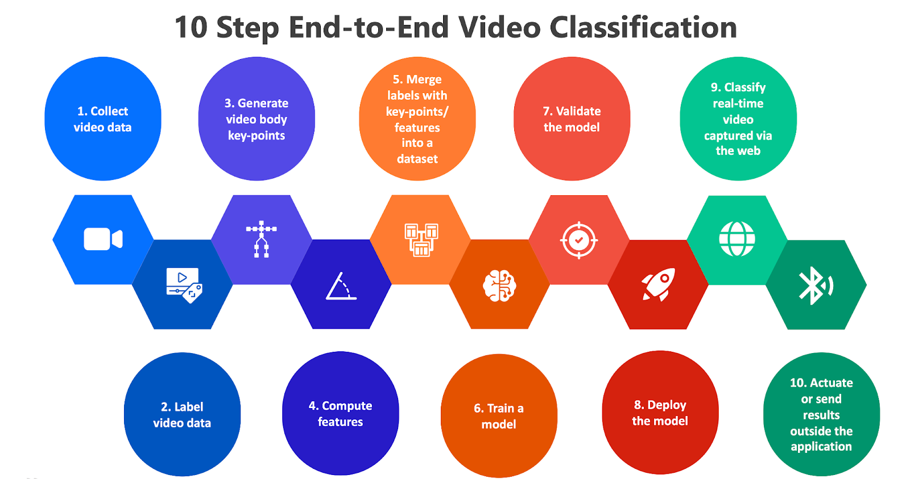

# StreamPoseML
#### An End-to-End Open-Source Web Application and Python Toolkit  for Real-Time Video Pose Classification and Machine Learning
[](https://opensource.org/licenses/MIT)

[](https://zenodo.org/doi/10.5281/zenodo.10161979)

StreamPoseML is an open-source, end-to-end toolkit for creating realtime, video-based classification experiments that rely on using labeled data alongside captured body keypoint / pose data. The process for building a real-time video classification application typically looks something like this:

<!-- 1. Collect video data
2. Label video data
3. Generate pose keypoints from video
4. Compute features
5. Merge annotations/labels with keypoints/features into a dataset
6. Train a model
7. Run experiments
8. Deploy the trained the model
9. Classify real-time video captured via the web or some other input source
10. Actuate or send results outside the application -->



StreamPoseML aspires to help with steps 3-10, with the aim of making a system portable enough to be run wherever a Python environment can run in the case of steps 3-7, and wherever a Docker container can run, in the case of steps 8-10.

Additionally, StreamPoseML aims to provide flexibility with respect to coding and classification schemes. There are ready-baked video annotation + classification solutions out there, however they can be costly and not suited for every task. For a Python dev or data scientist, StreamPoseML provides convenient abstractions for working with video data in a way that can mesh with your own workflow, on your own hardware, for free, and provides a starting point for creating your own portable, browser-based real-time classification / actuation system. 

## Toolkit usage

The two main parts of StreamPoseML are the sample web application and the Python module. The web application is intended to run within a Docker environment. Comprising a basic React front-end and a Flask back-end, it can be pulled from Dockerhub to run as-is or can be modified to suit your needs. 

See instructions below for running the out-of-the-box sample web application.

To install the Python module for usage in your own Python project:

```
pip install stream_pose_ml
```

Then you can:

```
import stream_pose_ml
```

The three packages you'll use likely use directly are the `process_videos_job`, the `build_and_format_dataset_job`, and the `model_builder`. in the example notebooks you'll see these imported like so:

```
import stream_pose_ml.jobs.process_videos_job as pv
import stream_pose_ml.jobs.build_and_format_dataset_job as data_builder 
import stream_pose_ml.learning.model_builder  as mb
```


## Keypoint extraction

StreamPoseML currently uses [Mediapipe](https://developers.google.com/mediapipe), which is based on [BlazePose](https://arxiv.org/abs/2006.10204), to extract body keypoints. This is because StreamPoseML was developed to assist with realtime video classification tasks that could potentially run on relatively ubiquitous devices, perhaps in a therpeutic or live performance setting. The aim is to provide a system to enable anyone with a webcam to be able to classify video in real-time. Additionally, some keypoint coordinates in the video processing steps are computed to be more consistent with [OpenPose](https://github.com/CMU-Perceptual-Computing-Lab/openpose) landmarks.

The process for extracting keypoints looks like this:

```
import stream_pose_ml.jobs.process_videos_job as pv

pv.ProcessVideosJob().process_videos(
    src_videos_path='/path/to/source/videos',
    output_keypoints_data_path='/path/to/output/frame/keypoints',
    output_sequence_data_path='/path/to/output/video/sequences',
    write_keypoints_to_file=True,
    write_serialized_sequence_to_file=True,
    limit=None,
    configuration={}, # mediapipe configuration
    preprocess_video=True,
    return_output=False
)
```

You pass a directory containing your videos. Each video will be run through mediapipe. In the keypoints directory, namespaced to each video, json keypoint representations will be saved. Additionally, the entire video's keypoints will be serialized into a video sequence and stored in a parallel directory. These files can be used directly in a training regime, or you can use StreamPoseML's dataset building tools to format sequence data into other formats.

## Feature engineering

There are currently various options available that take the raw keypoint data and build upon it to generate normalized angle and distance measurements for use in building your dataset. 

In particular, there are various segmentation strategies that can be used to organize the raw keypoint data based on combinations of window size, temporal pooling, and various angle and distance measurements. Please explore the notebookes in `./stream_pose_ml/notebooks` for usage examples. However generally speaking it's probably most useful to use a segmentation strategy of `none` to generate your dataset, then from there you can explore different data structure more easily with a tool such as `pandas`.

## Merging annotations with video keypoints / features

A pain point found in related research was the lack of accessible tooling for merging keypoint data from training videos with the actual labeled annotation data. While there are tools that exist to annotate videos for model training, often in research contexts a specific annotation process is used at perhaps a different than the training will occur, making it cumbersome to later merge the annotation data with the video data. This work can be tedious on top of the already tedious task of labeling the data to begin with. 

However this task is straightforward with StreamPoseML assuming you have structured annotation data. You'll want to follow the folder structure conventions in this repo, so the best way is to simply clone this repo locally and work within it to process your data.

First, take note of `config.yml` and its defined annotation schema.

To use your own annotations, you'll need to update the annotation schema to match your annotation data. StreamPoseML assumes that you'll have one annotation file for each video you are training on and they can all live within one directory. However make sure they they share their name with the matching video. A single video may have many annotations. Currently StreamPoseML support JSON, but in future work other formats could be used. Your contribution to this area would be welcome!

Here's an example of a valid annotation file for video named `example_video.webm`:

```
example_video.json

 {
   "name": "example_video.webm",
   "annotations": [
     {
       "label": "Left Step",
       "metadata": {
         "system": {
           "startTime": 5.472133333333334,
           "endTime": 6.940266666666667,
           "frame": 164,
           "endFrame": 208
         }
       }
     }
     ...
   ]
 }
```

Then here's what your annotatoin schema definition in `config.yml` should look like:

```
annotation_schema: # assume one annotation file per video where there is a list of annotations
  annotations_key: "annotations" # the key in the annotation file that contains the list of annotations
  annotation_fields: # the fields in the annotation file that map to the video data
    label: label # the label field in the annotation list
    start_frame: metadata.system.frame # the starting video frame for the annotation
    end_frame: metadata.system.endFrame # the ending video frame for the annotation
  label_class_mapping: # for each label (Key), map to a class (Value), i.e. Dog: animal, or Truck: vehicle, or 0: has_something
    Left Step: step_type
    Right Step: step_type
    Successful Weight Transfer: weight_transfer_type
    Failure Weight Transfer: weight_transfer_type
```

## Creating datasets with features

StreamPoseML was built while conducting studies of Parkinson's Disease patients in dance therapy settings. This research was done with support from the [McCamish Foundation](https://parkinsons.gatech.edu/). From these efforts, you can see a notebook example showing how to use StreamPoseML to build a training dataset.

To get a feel for building your dataset using StreamPoseML, see `/stream_pose_ml/notebooks/example_usage.ipynb`

The process looks like this:

```
import stream_pose_ml.jobs.build_and_format_dataset_job as data_builder 

# This is the main class that does all the work
db = data_builder.BuildAndFormatDatasetJob()

# Here you'll specify the path to you annotations and StreamPoseML generated sequences
dataset = db.build_dataset_from_data_files(
    annotations_data_directory=source_annotations_directory,
    sequence_data_directory=sequence_data_directory,
    limit=None,
)

formatted_dataset = db.format_dataset(
    dataset=dataset,
    pool_frame_data_by_clip=False,
    decimal_precision=4,
    include_unlabeled_data=True,
    include_angles=True,
    include_distances=True,
    include_normalized=True,
    segmentation_strategy="flatten_into_columns",
    segmentation_splitter_label="step_type",
    segmentation_window=10,
    segmentation_window_label="weight_transfer_type",
)

db.write_dataset_to_csv(
    csv_location=merged_annotation_output_directory,
    formatted_dataset=formatted_dataset,
    filename="preprocessed_flatten_on_example_10_frames_5"
)
```

For most training tasks you may not want to get too clever with the features and may just want to train on flat representations of raw keypoints. 

The simplest approach is:

```
formatted_dataset = db.format_dataset(
    dataset=dataset,
    pool_frame_data_by_clip=False,
    decimal_precision=4,
    include_unlabeled_data=True,
    include_angles=False,
    include_distances=False,
    include_normalized=False,
    segmentation_strategy="none",
)
```

This will give you one row per frame with columns for each x, y, z coordinate in addition to your labeled data. From there you can use pandas or whatever you like to further window or segment your data.


## Training models

Once you have a dataset to work with, you can use whatever process you like to train and evaluate your models. But here you'll find some convenience methods for training and evaluation abstracted on top of a few popular machine learning libraries. These are scoped to a Model Builder class created to speed up iterations and model evaluation using the metrics we found useful in our research. It may not suit your particular needs, but have a look and feel free to make contributions.

See the `/stream_pose_ml/notebooks/example_usage.ipynb` for usage examples and see `/stream_pose_ml/stream_pose_ml/learning/model_builder.py` to see what's available.

## Saving your model

If you want to use your trained model in StreamPoseML's web application, you'll need to save it as a "pickle" so that it can be loaded into the application server at runtime. You may need to wrap it in a class before you do this such that when it is loaded it responds  with a result when the method "predict" is called on it.

But if you've used StreamPoseML's model builder you can save the model instance like so:

`model_builder.save_model_and_datasets(notes=notes, model_type="gradient-boost")`

In the future, the plan is to use a more standardized approach to saving models, such as [Cog](https://github.com/replicate/cog).

## Running the Sample Web Application

First, as mentioned above, you'll need a trained classifier saved to a pickle file. A sample model is provided in the `example_data` folder. The model should implement a "predict" method that takes an array of examples to classify. For realtime video classification generally you'll want to pass a single example

The pickle object should be shaped like this:

```
{
  classifier: <your_trained_model implementing predict method>
}
```

You will load this model into the web application to classify streaming keypoint data with it. 

Provided is a simple Flask API that sits behind a React UI. The UI was tailored for our specific use case in classifying types of steps captured via webcam, however you can adapt this for your own model classification scheme.

To run the sample app you'll need to pull the latest builds from Dockerhub:

1. Visit docker.com and sign up for an account.
2. Download the [Docker Desktop](https://www.docker.com/products/docker-desktop/) client for your your system, launch, and log in.
3. From your terminal, git clone this repo and enter the directory.
4. Run `start.sh` to pull down the latest images (backend and frontend) and spin them up with Docker Compose.

This should install the necessary dependencies and then launch the application in your default browser (Chrome is recommended for full feature support).

5. When you're done, run `stop.sh` to gracefully end the application processes.

## Running the web application locally

The previous method relies on Docker Compose to pull the latest builds from Dockerhub. However, if the web application is of any use to you, you'll probably want to tinker with it to suit your needs. Then you'll want to run it locally or perhaps build and deploy it on your own infrastructre.

Local development against local containers is easiest with [Tilt](tilt.dev) and [Minikube](https://minikube.sigs.k8s.io/docs/). Once installed (in addition to Docker), you can simply run `tilt up`.

The app should be available on `localhost:3000`. The API is served on `localhost:5001` and should be accessible from the web app. There is a bluetooth actuation scheme built in, however currently only Chrome supports this.

## Building & Deploying the Web Application

After adjusting some of this code for your own use case, you may wish to build and push Docker images to your own registry to deploy an application based on StreamPoseML. There are two main components with respect to StreamPoseML's web application: the API and the UI. For example, to build each:

```
cd stream_pose_ml && docker build -t myuser/stream_pose_ml_api:latest -f Dockerfile .
cd web_ui && docker build -t myuser/stream_pose_ml_web_ui:latest -f Dockerfile .
```

Then you can push them and deploy them however you see fit, e.g. ECR / K8s.

```
docker push myuser/stream_pose_ml_api:latest
docker push myuser/stream_pose_ml_web_ui:latest
```

## Citing

If you use the project in your work or research, please cite this repository or the corresponding paper. See [paper.md](paper.md).

## Contributions

Contributions are welcome! For guidelines and more details for working with this package locallay see:

[CONTRIBUTING.md](CONTRIBUTING.md)