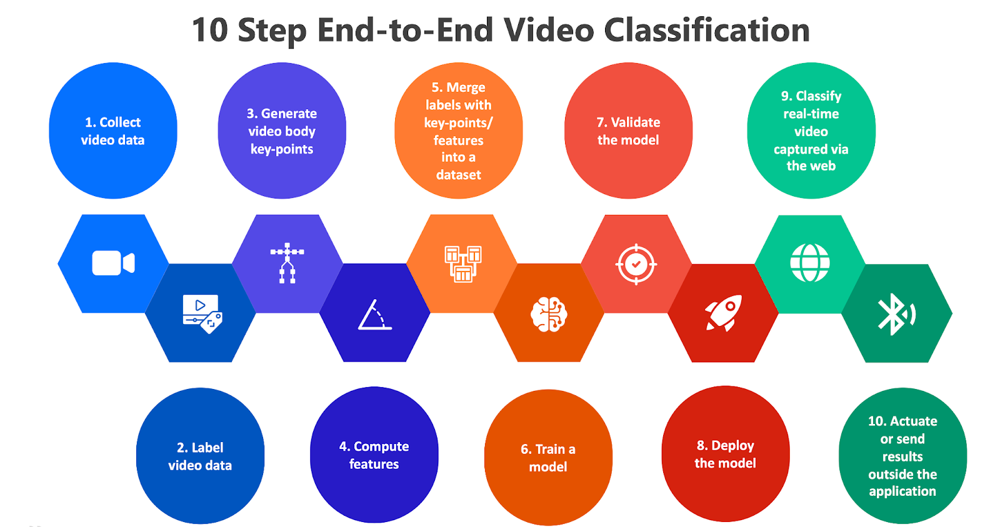

# Summary

With the ubiquity of video content in various sectors, from surveillance to entertainment to education, the demand for effective video analytics has never been greater - video data are being produced and consumed at an unprecedented rate, leading to an increased need for end-to-end research tools to integrate, manage, and utilize this massive influx of information. Classifying videos using machine learning often involves a series of data processing steps – data collection, annotation, pre-processing, model training, and deployment. These tasks require different tools and skill sets, making the process fragmented, time-consuming, and complex. Currently, many open-source machine learning pipelines require users to manually integrate different tools and libraries, which can be time-consuming and error-prone. There is a significant need for tools that can automatically develop an end-to-end machine learning pipeline, especially for human motion classification. A unified platform that can handle multiple stages in the machine learning pipeline will greatly streamline the workflow, saving time, reducing complexity, and lowering the barrier to entry for practitioners without extensive machine learning expertise. Our proposed web application and Python toolkit, “StreamPoseML” is an open-source, end-to-end toolkit for creating real-time, video-based classification experiments based on labeled data and body keypoint/pose estimation of human movements. It provides the capability of dataset generation, pre-processing, model building and training, as well as deployment in a real-time environment. Users will be able to monitor and adjust their models on the fly in the backend and test their models using a front-end UI. To illustrate its use, we provide an examples of on-going research on designing a real-time trial-to-trial movement classification for older adults undergoing Adapted Tango dance therapy.

# Statement of Need

The lack of tools available for open-source end-to-end machine learning pipelines, particularly for motion classification, is a recognized challenge in the field [@orhei2021end]. \autoref{fig:example} illustrates the typical ten stages of an end-to-end video classification pipeline. While there are various individual tools and paid platforms available for each stage of the machine learning workflow, such as video annotation, e.g., Dataloop, LabelBox; data management and pre-processing, e.g., Postgres, SPSS; or unified machine learning services, such as Google Cloud, AWS SageMaker, Microsoft Azure, IBM Watson, and Databricks among others, there is a lack of an open-source integrated solution that streamlines those stages in an easy-to-used single pipeline. 

Motion assessment classification is iterative in nature, which involves going back and forth between stages for validating the detected body keypoints, features, and model performance quality.

Recent initiatives have introduced open-source tools like Google's Teachable Machine, a web-based platform for developing basic machine learning models. This tool is user-friendly and easily accessible, yet it comes with a number of limitations. Its primary drawback is the limited customization and control it offers; users cannot alter the underlying features, algorithms, or hyperparameters, restricting advanced usage and complex project development. Additionally, data privacy is a concern since user data is uploaded to Google's servers, posing potential risks for breaches in sensitive and identifiable information. Scalability is another issue, as it is designed as an educational platform for machine learning that is limited in processing large datasets and tuning models for real-world applications. The dependency on a stable internet connection, limited data processing capabilities, lack of integration with other tools and platforms, performance issues with large models, and no control over the training environment further underline its limitations for professional use. Thus, while the Teachable Machine is excellent for introductory purposes, its constraints render it less viable for advanced applications for developing models in complex scenarios. 

We identified several frameworks and toolkits in the literature, each allowing advanced applications for data handling and analysis workflows, machine learning frameworks, documentation of experiments, and optimizing hyperparameters [@tokui2019chainer] [@holmes1994weka] [@hall2009weka] [@williams2009rattle] [@gould2012darwin] [@schindelin2012fiji] [@kiefer2013emzed] [@alberti2018deepdiva] [@orhei2021end]. However, these toolkits do not address the complete pipeline comprehensively with the ability to 1) include pose estimation integration, 2) compute features and include them in a dataset, 3) present the results on a web application, and 4) actuate or send out the result to a subsequent tool via Bluetooth. These steps present a crucial point for the integration of video data, human pose estimation, and deployment for research activities, particularly for the bioinformatics and rehabilitation domains.

Our proposed solution fills this crucial gap. Not only will our toolkit allow users to build and train models in real time, it is also capable of data generation, allowing users to create diverse and robust datasets for their specific needs. This end-to-end approach will enable users to iterate more rapidly on their models, experiment with different configurations, and calibrate the pipelines interactively in real-time. VidPoseClass toolkit also makes the system portable through  Python environments (steps 3-7) and Docker containers (steps 8-10).

The flexibility and accessibility of our proposed platform provide solutions for a wide range of users, from industry professionals seeking to improve their business operations to academic researchers conducting cutting-edge studies and educators teaching the next generation of data scientists on human movement assessment. This toolkit will accelerate research by providing a robust and flexible platform to experiment and innovate.

# Use Case

We currently use the tool for an ongoing research project that involves the creation of real-time feedback for adapted tango dance therapy for older adults with and without Parkinson’s disease.
Currently, motor training for rehabilitation therapy or skill improvement often requires an on-site therapist or instructor who makes a trial-to-trial visual assessment and provides verbal feedback or manual intervention, which is costly and limits access to care. The first use case utilizes StreamPoseML to train a classification model to identify and provide real-time feedback when instructed backward Tango walking is performed successfully by older adults who may or may not have Parkinson’s Disease. We identify each movement execution on a trial-to-trial basis utilizing marker-less motion capture with a standard video camera, such as a webcam. Our pipeline provides an important step toward users conducting on-demand movement testing in their homes through objective and automated assessments and feedback made by artificial intelligent models.

# Acknowledgements

We acknowledge the assistance of Koki Asahina (Georgia Institute of Technology) in preparing the source data and constructive comments of Dr. Hyeokhyen Kwon (Emory University) on the draft. This study was partially supported by the McCamish Parkinson’s Disease Innovation Program at Georgia Tech and Emory University.

# References
